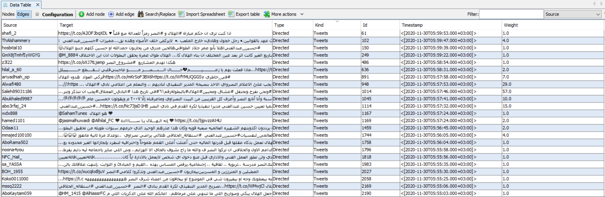

# GephiPY

#  
# Importing csv data in Gephi [The method takes time]
- [Importing csv data in Gephi](https://seinecle.github.io/gephi-tutorials/generated-html/importing-csv-data-in-gephi-en.html)
# Description
A simple python script to convert excel data to Gephi project.

> **Note:** It's depends on the shape of the a data for each project

#Quick Start
-----------
```console
pip3 install -r requirements.txt

python3 GephiPY.py
```
#  

# 
# 
# 
# 

#  
## Resources
1-[docs.python.org](https://docs.python.org/3/library/xml.etree.elementtree.html) <br>
